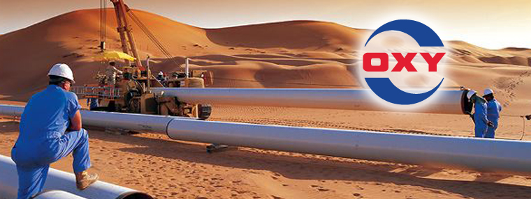
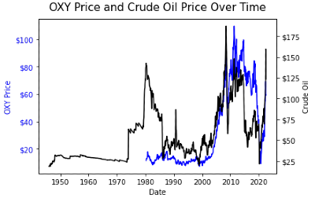
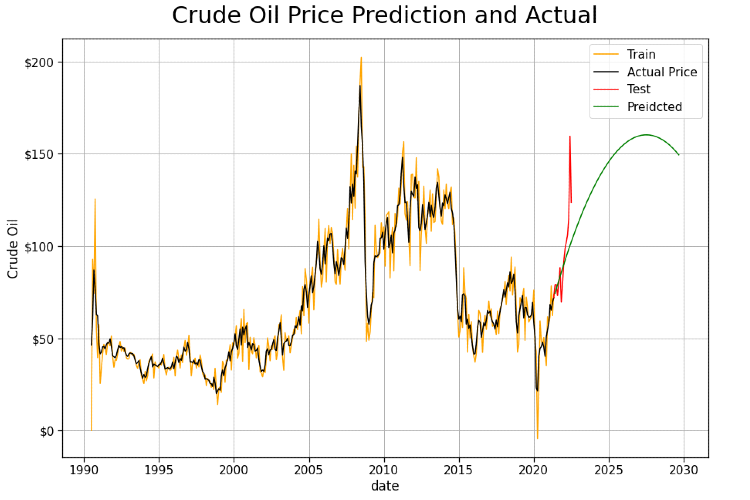
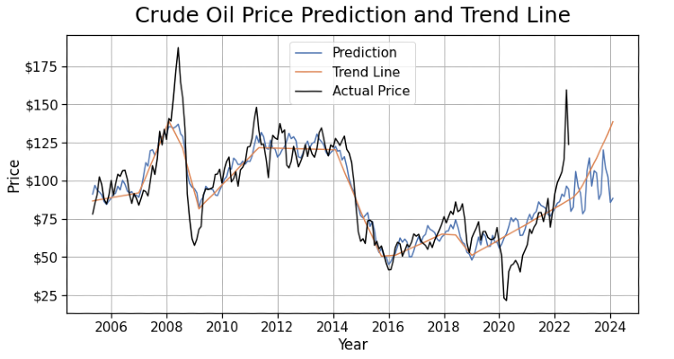

## Repo Navigation
[Final Jupyter Notebook.ipynb](https://github.com/WoojinJun/Global_Economic_Prediction/blob/main/FinalNotebook.ipynb)


[Presentation.pdf](https://github.com/WoojinJun/Global_Economic_Prediction/blob/main/Global_Economic_Prediction.pdf)
```
.
├── README.md
├── data
│   ├── gold.csv
│   ├── crude_oil.csv
│   ├── dow_jones.csv
│   ├── fed_funds.csv
│   └──  OXY_Historical_Data.csv
├── .ipynb_checkpoints
│   ├──ScratchNotebook-checkpoint.ipynb
├── images
│   ├── ARIMA.png
│   ├── facebook.png
│   ├── price.png
│   ├── oxy-petroleum.jpeg
│   └── heatmap.png
├── .gitignore
├── FinalNotebook.ipynb
├── ScratchNotebook.ipynb
├── Global_Economic_Prediction.pdf
└── Jupyter_Notebook.pdf
```


# Global Economic Prediction - Crude Oil

*Woojin Jun* 


Due to the war between Ukraine and Russia and limitations on gas supplies, crude oil price has increased since Covid 19. It seemed that the price met the peak in June, and in July, the price decreased about 15%. 

However, Berkshire Hathaway recently invested five billion dollars in Occidental Petroleum. I am investigating the relationship between crude oil price and Occidental Petroleum stock price, and predicting the future peak of crude oil price. 



---
## Business understanding  

Stakeholder: Occidental Petroleum

Business Problem: Find relationship between crude oil and Occidental Petroleum stock price, and predicting the future peak of crude oil price.

---  
## Data understanding  

The data of monthly crude oil price from January 1946 to July 2022 and monthly Occidental Petroleum stock price from April 1980 to July 2022 was gathered from TradingView and MacroTrends. 

Among some economic factors, such as Dow Jones, gold, federal funds, and crude oil, crude oil has the highest correlation with the petroleum stock price. 




---
## Models  

After cleaning data, I used two different model to predict and forecast future gas prices. First, I used ARIMA model.

RMSE for ARIMA Train model was $9.64

RMSE for ARIMA Test model was $18.64

The highest peak of gas price in next 10 years is expected on July 2027




Next, I used Facebook Prophet. 




RMSE for Meta Prophet Test model was $14.08

---


---
## Recommendations  

Short term price adjustment is expected in November 2023, but rising trend is expected until July 2027. For the next 5 years, high demand and high price of crude oil require expension in crude oil exploration and supply chains. The rising trend in Occidental Petroleum stock price is expected.  

---
